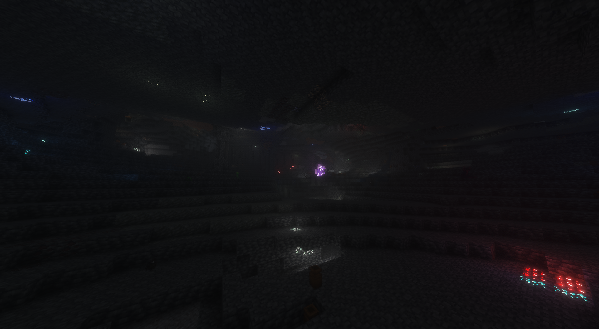

# SweetScience
SweetScience is a high-fantasy world combined with machinery and electronic automation!

It provides a cozy, yet dangerous atmosphere to explore, where many new mobs and creatures roam the land. Floating airships and islands hover above the surface, while new ores shimmer in the caverns below...
Vast colorful forrests flow across the overworld, whilest being compressed in spacetime by a _number_ of other dimensions, just waiting to be exploited.

Or not! It's up to you, Lord of All Factories, Hunter of the Wicked, or just a simple farmer.

MC 1.21.1 Only; 
Neoforge 21.1.217 Only

[Download Here](https://github.com/TaterTot420/SweetScience/raw/refs/heads/main/SweetScience%201.0.3.mrpack)
# Server-Side
Server versions of the pack also exist! 
__Although it is packed as a Modrinth pack, it must be unpacked before being placed into server root__ 

Unzip with your favorite software, 
Place ALL configs into the server subfolder: /config 
Place ALL .jar `s into server subfolder: /mods 

Although Prism launcher and Curse _say_ they can export a server pack cleanly, it hasn't worked in my experience.
(Yes.. I will add them as a raw zip file. Someday.)

[Download Server Side Here](https://github.com/TaterTot420/SweetScience/raw/refs/heads/main/SweetScience%20SERVER%20SIDE%201.0.3.mrpack)
# Gallery

  <i>Deep Caves...</i>

# Accessibility
Currently this is the only place you can get it! 
Although I'm not happy about that. Despite the irony of being a Modrinth file, they won't actually let me upload it. Curse might have the same problem, but I haven't found out yet, since my curse enviroment is wayyy out of date.
